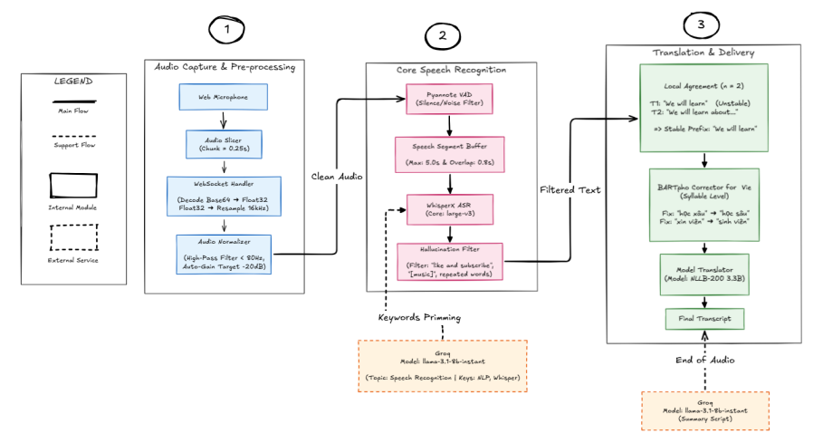
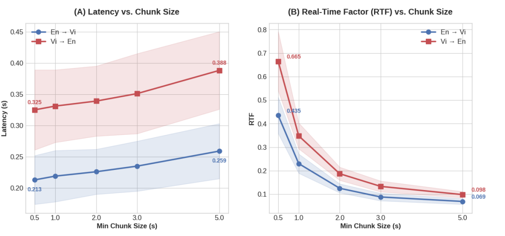
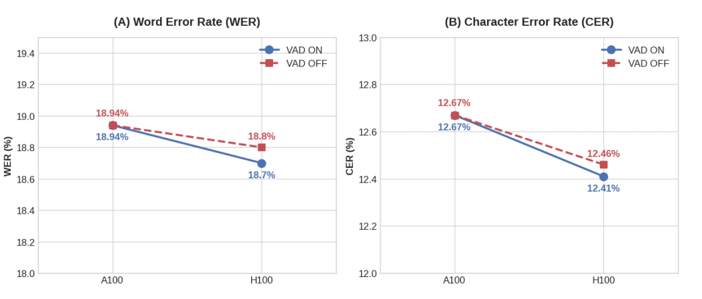

<p align="center">
  <h1 align="center">Developing a real-time bilingual speech-to-text conversion system</h1>
  <p align="center">
    <strong>Real-time Vietnamese → English Neural Speech Translation</strong>
    <br>
    <em>Low-latency, production-ready pipeline for academic environments.</em>
  </p>
</p>

<p align="center">
  
  
  
  
</p>

---

## ⚡ Overview

**Developing a real-time bilingual speech-to-text conversion system** is a high-performance, real-time speech translation system specifically optimized for Vietnamese lectures. It transforms live audio into dual-language transcripts with under **600ms** end-to-end latency.

Built on top of **WhisperX**, **BARTpho**, and **NLLB-200**, it solves typical real-time ASR pain points: hallucinations, terminology corruption, and display flickering.

---
<p align="center">
  
</p>

## 📐 System Architecture

The system utilizes a serverless GPU architecture on **Modal**, allowing for elastic scaling and zero-maintenance infrastructure.

<p align="center">
  
</p>

---

## ✨ Key Features

- 🚀 **Sub-second Latency**: Processing optimized for real-time streaming using segment-based buffering.
- 🎯 **Domain-Aware**: Groq-powered context priming expanding lecture topics into ASR keywords.
- 🛠️ **Smart Correction**: "English-Aware" BARTpho post-processing that fixes Vietnamese spelling while protecting technical terms like *API, Neural Network, Docker*.
- 🖼️ **Stable UI**: Local Agreement algorithm prevents "flickering" in partial transcriptions.
- 🌊 **Seamless VAD**: Pyannote neural segmenter ensures high accuracy even in noisy environments.
- 📝 **Auto-Summarization**: Generating markdown summaries of entire sessions automatically.

---

## 🛠️ Technology Stack

| Layer | Component | Technology | 
| :--- | :--- | :--- |
| **ASR** | **Speech Recognition** | `WhisperX (large-v3)` with CTranslate2 engine |
| **VAD** | **Audio Segmentation** | `Pyannote Audio` (Neural segmentation) |
| **NLP** | **Syllable Correction**| `BARTpho + LoRA` (English-aware adapter) |
| **NMT** | **Translation Engine** | `NLLB-200 (3.3B)` (High-performance translation) |
| **AI** | **Context & Summary** | `LLaMA 3.1 (Groq API)` for intelligence |
| **Cloud**| **Compute Layer** | `Modal` (Serverless NVIDIA A100 GPUs) |
| **Web**  | **Real-time Comms** | `FastAPI` + `WebSockets` |

---

## 🚀 Quick Start

### 1. Prerequisites
- [Modal Token](https://modal.com/docs/guide/token)
- [uv](https://github.com/astral-sh/uv) (Extremely fast Python package manager)
- [Groq API Key](https://console.groq.com/keys) (Optional)

### 2. Setup environment
```bash
# Clone the repository
git clone https://github.com/Senju14/Speech_to_text-realtime-for-lecture-hall.git
cd Speech_to_text-realtime-for-lecture-hall

# Create virtual environment and install dependencies using uv
uv venv
source .venv/bin/activate  # On Windows: .venv\Scripts\activate
uv pip install -r requirements.txt

# Configure secrets
modal token new
modal secret create groq-api-key GROQ_API_KEY=your_key_here
```

### 3. Deploy
```bash
modal deploy main.py
```
> 🌐 **Visit the URL** in the terminal output to start transcribing!

---

## 📊 Benchmarks

Evaluated on **NVIDIA A100 40GB** using Google FLEURS VI test set.

| Metric | Performance |
|---|---|
| **End-to-End Latency** | ~604ms (3s chunks) |
| **RTF (Real-Time Factor)** | ~0.20 |
| **VAD GPU Savings** | 15.9% |
| **Hallucination Rejection** | 776 segments caught |

<p align="center">
  
</p>

---

## 📁 Project Structure

```
├── .env.example             # Template for API keys and configuration
├── main.py                  # Modal entry point & FastAPI session handler
├── backend/                 # AI Core - Multi-stage pipeline
│   ├── config.py            # Global hyper-parameters & model paths
│   ├── handler.py           # ASRService orchestration & WebSocket logic
│   ├── asr.py               # WhisperX engine with adaptive normalization
│   ├── vad.py               # Pyannote-based neural speech detection
│   ├── bartpho_corrector.py # English-aware Vietnamese syllable fixer
│   ├── translation.py       # NLLB-200 NMT service
│   ├── speech_segment_buffer.py # Buffering with overlap context
│   ├── local_agreement.py   # Transcript stabilization algorithm
│   └── audio_normalizer.py  # Signal processing & noise floor management
├── frontend/                # Vanilla JS Web UI
│   ├── js/audio.js          # AudioWorklet (16kHz) capture
│   └── js/ui.js             # Real-time dual-lang rendering
└── test/                    # Academic benchmark scripts
```

---

## 📝 License & Credits
Licensed under the [MIT License](LICENSE).

Developed as a Graduation Thesis for **Ton Duc Thang University**.
